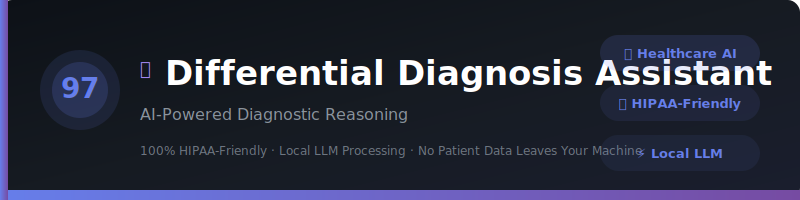
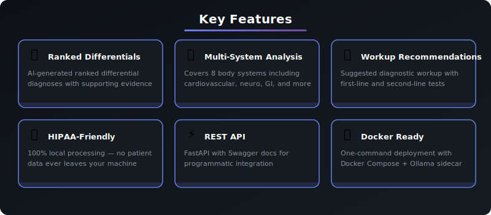
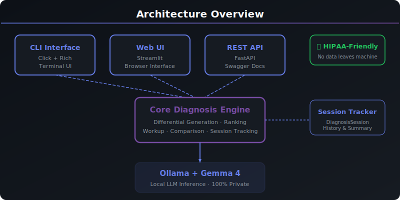

<div align="center">



# 🏥 Differential Diagnosis Assistant

### AI-Powered Diagnostic Reasoning

[](https://python.org)
[](https://ollama.com)
[](LICENSE)
[]()
[]()
[]()
[]()

</div>

---

> ## ⚠️ Medical Disclaimer
>
> **This tool is for educational purposes only. It is NOT a substitute for professional medical advice, diagnosis, or treatment. Always consult a qualified healthcare provider for medical concerns. Never disregard professional medical advice or delay seeking it because of information from this tool.**
>
> - 🚨 **Call 911** for medical emergencies
> - 📞 **Call 988** for mental health crises (Suicide & Crisis Lifeline)
> - 💬 **Text HOME to 741741** for Crisis Text Line
>
> *The developers assume no liability for any actions taken based on this tool's output.*

---

<div align="center">

[✨ Features](#-features) · [🚀 Quick Start](#-quick-start) · [💻 CLI Reference](#-cli-reference) · [🌐 Web UI](#-web-ui) · [📖 API Reference](#-api-reference) · [🏗️ Architecture](#️-architecture) · [🔒 HIPAA](#-hipaa-compliance) · [❓ FAQ](#-faq)

</div>

---

## 📋 Overview

An intelligent differential diagnosis assistant that leverages local LLMs to generate ranked differential diagnoses from symptoms, patient history, and examination findings — all running privately on your machine with **zero patient data leaving your system**.

Built as part of the **Local LLM Projects** series (Project #97/90), this tool demonstrates how AI can be applied to clinical education while maintaining complete data privacy through local model inference.

### Why This Project?

| | Feature | Description |
|---|---------|-------------|
| 🔒 | **100% HIPAA-Friendly** | All patient data stays on your machine — no cloud uploads, ever |
| 📋 | **Ranked Differentials** | AI-generated differential diagnoses ranked by likelihood |
| 🧪 | **Workup Recommendations** | Suggested diagnostic workup for each differential |
| ⚖️ | **Diagnosis Comparison** | Compare two diagnoses side by side with distinguishing features |
| 🔍 | **Multi-System Analysis** | Coverage across 8 body systems |
| 💬 | **Interactive Reasoning** | Multi-turn chat for iterative diagnostic thinking |

---

## ✨ Features

<div align="center">



</div>

| Feature | Details |
|---------|---------|
| **Ranked Differentials** | AI-generated differential diagnoses ranked by likelihood with supporting/opposing evidence |
| **Multi-System Analysis** | Covers 8 body systems: cardiovascular, respiratory, GI, neurological, musculoskeletal, endocrine, infectious, psychiatric |
| **Workup Recommendations** | First-line and second-line investigations with specialist referral guidance |
| **Diagnosis Comparison** | Head-to-head comparison of two diagnoses with distinguishing features and key tests |
| **Session Tracking** | Track all consultations with timestamps, urgency levels, and AI responses |
| **Urgency Triage** | 5-level urgency scoring from Low to Emergency with automated keyword detection |

---

## 🚀 Quick Start

### Prerequisites

| Requirement | Version | Purpose |
|-------------|---------|---------|
| **Python** | 3.10+ | Runtime environment |
| **Ollama** | Latest | Local LLM inference engine |
| **Gemma 4** | Latest | AI model (downloaded via Ollama) |

### Installation

```bash
# 1. Clone the repository
git clone https://github.com/kennedyraju55/differential-diagnosis-assistant.git
cd 97-differential-diagnosis-assistant

# 2. Create virtual environment
python -m venv venv
source venv/bin/activate  # Linux/Mac
# or
.\venv\Scripts\activate  # Windows

# 3. Install dependencies
pip install -r requirements.txt

# 4. Ensure Ollama is running with Gemma 4
ollama pull gemma4
ollama serve
```

### First Run

```bash
# Verify installation
differential-diagnosis --help

# Run your first differential
differential-diagnosis diagnose --symptoms "chest pain radiating to left arm, diaphoresis, shortness of breath" \
  --patient-info "55M, HTN, DM2, smoker" \
  --exam-findings "BP 160/95, HR 110, diaphoretic"
```

### Expected Output

```
╭─────────────────────────────────────────────────────────────╮
│  ⚠️  MEDICAL DISCLAIMER                                     │
│  This tool is for educational purposes only.                │
│  Always consult a qualified healthcare provider.            │
╰─────────────────────────────────────────────────────────────╯

📊 Urgency Assessment: 🚨 Emergency

⏳ Generating differential diagnosis with local LLM...

╭─────────────────────────────────────────────────────────────╮
│  🔍 Differential Diagnosis                                   │
│                                                             │
│  1. Acute Myocardial Infarction (STEMI)  — Most Likely      │
│  2. Unstable Angina / NSTEMI                                │
│  3. Aortic Dissection                                       │
│  4. Pulmonary Embolism                                      │
│  5. Tension Pneumothorax                                    │
│                                                             │
│  ⚠️  Remember: This is not medical advice.                  │
╰─────────────────────────────────────────────────────────────╯
```

---

## 💻 CLI Reference

| Command | Description |
|---------|-------------|
| `diagnose` | Generate ranked differential diagnosis from symptoms |
| `workup` | Get workup recommendations for a specific diagnosis |
| `compare` | Compare two diagnoses side by side |
| `chat` | Interactive multi-turn diagnostic reasoning session |

### diagnose

```bash
differential-diagnosis diagnose \
  --symptoms "sudden onset severe headache, worst of life, neck stiffness" \
  --patient-info "35F, no significant PMH" \
  --exam-findings "photophobia, positive Kernig sign"
```

### workup

```bash
differential-diagnosis workup --diagnosis "Subarachnoid hemorrhage"
```

### compare

```bash
differential-diagnosis compare \
  --diagnosis1 "Subarachnoid hemorrhage" \
  --diagnosis2 "Meningitis" \
  --clinical-data "sudden severe headache with neck stiffness and photophobia"
```

### chat

```bash
differential-diagnosis chat
```

### Global Options

```bash
differential-diagnosis --help          # Show all commands and options
```

---

## 🌐 Web UI

This project includes a Streamlit-based web interface with a professional dark theme.

```bash
# Start the web server
streamlit run src/differential_diagnosis/web_ui.py

# Open in browser
# http://localhost:8501
```

| Feature | Description |
|---------|-------------|
| **Tabbed Interface** | Separate tabs for Differential, Workup, and Compare |
| **Symptom Input** | Free-text symptom entry with patient info and exam findings |
| **Body System Filter** | Dropdown filter for body systems |
| **Urgency Assessment** | Real-time urgency scoring with progress meter |
| **Session History** | Expandable history of all consultations |
| **Dark Theme** | Professional medical-grade dark UI |

> ⚠️ **Note**: The web UI connects to your local Ollama instance. No data leaves your machine.

---

## ⚡ REST API

Full FastAPI REST API with auto-generated Swagger documentation.

### Start the API Server

```bash
# Run directly
uvicorn src.differential_diagnosis.api:app --reload --port 8000

# Or with Docker
docker compose up api
```

### API Endpoints

| Method | Endpoint | Description |
|--------|----------|-------------|
| `GET` | `/health` | Health check |
| `POST` | `/diagnose` | Generate ranked differential diagnosis |
| `POST` | `/workup` | Get workup recommendations |
| `POST` | `/compare` | Compare two diagnoses |
| `GET` | `/disclaimer` | Get medical disclaimer |
| `GET` | `/docs` | Interactive Swagger UI |
| `GET` | `/redoc` | ReDoc documentation |

### Example Requests

#### Generate Differential Diagnosis

```bash
curl -X POST http://localhost:8000/diagnose \
  -H "Content-Type: application/json" \
  -d '{
    "symptoms": "chest pain, diaphoresis, shortness of breath",
    "patient_info": "55M, HTN, DM2, smoker",
    "exam_findings": "BP 160/95, HR 110, diaphoretic, S3 gallop"
  }'
```

#### Get Workup Recommendations

```bash
curl -X POST http://localhost:8000/workup \
  -H "Content-Type: application/json" \
  -d '{"diagnosis": "Acute myocardial infarction"}'
```

#### Compare Two Diagnoses

```bash
curl -X POST http://localhost:8000/compare \
  -H "Content-Type: application/json" \
  -d '{
    "diagnosis1": "Pulmonary embolism",
    "diagnosis2": "Pneumothorax",
    "clinical_data": "sudden dyspnea with pleuritic chest pain"
  }'
```

#### Health Check

```bash
curl http://localhost:8000/health
```

> 📖 Visit `http://localhost:8000/docs` for the full interactive API documentation.

---

## 🐳 Docker Deployment

Run this project instantly with Docker — no local Python setup needed!

### Quick Start with Docker

```bash
# Clone and start
git clone https://github.com/kennedyraju55/differential-diagnosis-assistant.git
cd differential-diagnosis-assistant
docker compose up

# Access the web UI
open http://localhost:8501

# Access the API
open http://localhost:8000/docs
```

### Docker Commands

| Command | Description |
|---------|-------------|
| `docker compose up` | Start app + Ollama |
| `docker compose up -d` | Start in background |
| `docker compose down` | Stop all services |
| `docker compose logs -f` | View live logs |
| `docker compose build --no-cache` | Rebuild from scratch |

### Architecture

```
┌─────────────────┐     ┌─────────────────┐     ┌─────────────────┐
│   Streamlit UI  │     │   FastAPI API    │     │   Ollama + LLM  │
│   Port 8501     │────▶│   Port 8000      │────▶│   Port 11434    │
└─────────────────┘     └─────────────────┘     └─────────────────┘
```

> **Note:** First run will download the Gemma 4 model (~5GB). Subsequent starts are instant.

---

## 🏗️ Architecture

<div align="center">



</div>

### Project Structure

```
97-differential-diagnosis-assistant/
├── src/
│   └── differential_diagnosis/
│       ├── __init__.py          # Package init
│       ├── config.py            # Configuration management
│       ├── core.py              # Core diagnostic engine
│       ├── cli.py               # Click CLI commands
│       ├── web_ui.py            # Streamlit web interface
│       └── api.py               # FastAPI REST API
├── tests/
│   └── test_core.py             # Unit tests (15+ tests)
├── common/
│   ├── __init__.py
│   └── llm_client.py            # Shared Ollama client
├── examples/
│   ├── demo.py                  # Demo script
│   └── README.md                # Examples documentation
├── docs/
│   └── images/
│       ├── banner.svg           # Project banner
│       ├── architecture.svg     # Architecture diagram
│       └── features.svg         # Feature grid
├── .github/workflows/
│   └── ci.yml                   # GitHub Actions CI
├── config.yaml                  # Model configuration
├── requirements.txt             # Python dependencies
├── setup.py                     # Package setup
├── Makefile                     # Build automation
├── Dockerfile                   # Container image
├── docker-compose.yml           # Multi-service deployment
└── README.md                    # This file
```

### Data Flow

```
Clinical Input → CLI/Web/API → Core Engine → Ollama (Gemma 4) → Ranked Differentials
                                    ↓
                           Urgency Assessment
                           Body System Mapping
                           Session Tracking
```

### Technology Stack

| Layer | Technology | Purpose |
|-------|-----------|---------|
| **CLI** | Click + Rich | Command-line interface with beautiful formatting |
| **Web** | Streamlit | Browser-based interface with dark theme |
| **API** | FastAPI | RESTful API with Swagger docs |
| **AI** | Ollama + Gemma 4 | Local LLM inference |
| **Config** | YAML | Configuration management |
| **Testing** | pytest | Unit and integration tests |
| **Deploy** | Docker | Containerized deployment |

---

## ⚙️ Configuration

```yaml
# config.yaml
model: "gemma4"
temperature: 0.3
max_tokens: 2048
log_level: "INFO"
ollama_url: "http://localhost:11434"

clinical:
  include_red_flags: true
  include_workup: true
  max_differentials: 10
```

### Environment Variables

| Variable | Default | Description |
|----------|---------|-------------|
| `OLLAMA_HOST` | `http://localhost:11434` | Ollama API endpoint |
| `OLLAMA_MODEL` | `gemma4` | Default LLM model |
| `LOG_LEVEL` | `INFO` | Logging verbosity |

---

## 🔒 HIPAA Compliance

This tool is designed with privacy as a first-class concern:

| Aspect | Implementation |
|--------|---------------|
| **Data Storage** | No patient data is persisted to disk — session-only memory |
| **Network** | Zero network transmission — all LLM inference is local |
| **Model** | Runs entirely on your machine via Ollama |
| **Logs** | No PHI in logs — only operational metadata |
| **Docker** | Isolated container with no external network access needed |

### Local vs Cloud Comparison

| Aspect | Local LLM (This Tool) | Cloud API |
|--------|----------------------|-----------|
| **Privacy** | ✅ 100% local — data never leaves your machine | ❌ Data sent to external servers |
| **Cost** | ✅ Free after setup | ❌ Pay per API call |
| **Speed** | ⚡ Depends on hardware | ⚡ Generally fast |
| **Internet** | ✅ Works offline | ❌ Requires connection |
| **Data Control** | ✅ Complete control | ❌ Third-party storage |
| **HIPAA Concerns** | ✅ No data transmission | ⚠️ BAA required |
| **Model Updates** | 🔄 Manual model pulls | ✅ Automatic updates |
| **Scalability** | ⚠️ Limited by hardware | ✅ Cloud-scale |

> 🔒 **For healthcare data, local LLM inference eliminates the risk of sensitive information exposure through network transmission.**

---

## 🧪 Testing

```bash
# Run all tests
pytest tests/ -v

# Run with coverage report
pytest tests/ --cov=src/differential_diagnosis --cov-report=html

# Run specific test class
pytest tests/test_core.py::TestGenerateDifferential -v

# Run with verbose output
pytest -v --tb=short
```

### Test Categories

| Category | Tests | Description |
|----------|-------|-------------|
| **TestDisclaimer** | 3 | Validates medical disclaimer content |
| **TestGenerateDifferential** | 5 | Core differential generation with mocked LLM |
| **TestRankDiagnoses** | 2 | Diagnosis re-ranking with mocked LLM |
| **TestWorkupRecommendations** | 2 | Workup recommendation generation |
| **TestDiagnosisSession** | 4 | Session tracking and summary |
| **TestConfig** | 2 | Configuration loading |
| **TestUrgencyAssessment** | 3 | Urgency scoring validation |
| **TestAffectedSystems** | 2 | Body system detection |
| **TestCompareDiagnoses** | 2 | Diagnosis comparison |
| **TestDisplayDisclaimer** | 1 | Disclaimer display |

---

## 📖 Programmatic Usage

```python
from differential_diagnosis.core import (
    generate_differential,
    get_workup_recommendations,
    compare_diagnoses,
    assess_urgency,
    get_affected_systems,
    DiagnosisSession,
)

# Generate differential diagnosis
result = generate_differential(
    symptoms="sudden onset severe headache, worst of life",
    patient_info="35F, no significant PMH",
    exam_findings="neck stiffness, photophobia, positive Kernig sign",
)
print(result)

# Get workup recommendations
workup = get_workup_recommendations("Subarachnoid hemorrhage")
print(workup)

# Compare two diagnoses
comparison = compare_diagnoses(
    "Subarachnoid hemorrhage",
    "Meningitis",
    "sudden severe headache with neck stiffness and photophobia",
)
print(comparison)

# Assess urgency (1-5)
level, label, advice = assess_urgency("chest pain difficulty breathing")
# Returns: (5, "🚨 Emergency", "SEEK IMMEDIATE MEDICAL ATTENTION...")

# Identify affected body systems
systems = get_affected_systems("headache with nausea and chest pain")
# Returns: ["neurological", "gastrointestinal", "cardiovascular"]

# Track session
session = DiagnosisSession()
session.add_entry("chest pain", "55M", "diaphoretic", 5, ["cardiovascular"], result)
print(session.get_summary())
```

---

## 🏥 Body System Reference

The built-in analysis covers **8 body systems** with comprehensive symptom mapping:

<details>
<summary><strong>Cardiovascular</strong></summary>

- Chest pain, palpitations, dyspnea on exertion
- Orthopnea, edema, syncope
- Claudication, jugular venous distension

</details>

<details>
<summary><strong>Respiratory</strong></summary>

- Cough, shortness of breath, wheezing
- Hemoptysis, pleuritic pain, sputum production
- Stridor, tachypnea

</details>

<details>
<summary><strong>Gastrointestinal</strong></summary>

- Abdominal pain, nausea, vomiting
- Diarrhea, constipation, melena, hematochezia
- Dysphagia, jaundice, ascites

</details>

<details>
<summary><strong>Neurological</strong></summary>

- Headache, dizziness, seizure
- Weakness, numbness, altered mental status
- Vision changes, aphasia, tremor

</details>

<details>
<summary><strong>Musculoskeletal</strong></summary>

- Joint pain, back pain, muscle weakness
- Swelling, stiffness, deformity
- Limited range of motion, crepitus

</details>

<details>
<summary><strong>Endocrine</strong></summary>

- Fatigue, weight change, polyuria, polydipsia
- Heat/cold intolerance, hair loss, tremor

</details>

<details>
<summary><strong>Infectious</strong></summary>

- Fever, chills, night sweats
- Lymphadenopathy, malaise, rash
- Sore throat, dysuria

</details>

<details>
<summary><strong>Psychiatric</strong></summary>

- Anxiety, depression, insomnia
- Hallucinations, suicidal ideation, paranoia
- Agitation, confusion

> If experiencing thoughts of self-harm, call **988** immediately.

</details>

### Urgency Level Reference

| Level | Indicator | Examples | Action |
|-------|-----------|----------|--------|
| 1 | 🟢 Low | Mild discomfort, minor bruise | Self-care, monitor |
| 2 | 🟡 Mild | Mild headache, minor cold | Schedule routine appointment |
| 3 | 🟠 Moderate | Persistent fatigue, recurring headache | See doctor soon |
| 4 | 🔴 High | Severe pain, hemoptysis | Urgent care / ER |
| 5 | 🚨 Emergency | Chest pain, difficulty breathing, seizure | **Call 911 NOW** |

> The urgency scoring is a rough guide only. When in doubt, always seek immediate medical attention.

---

## ❓ FAQ

<details>
<summary><strong>Can this replace a doctor or clinical decision support system?</strong></summary>
<br>

Absolutely NOT. This is an educational tool only. It demonstrates how AI can assist in diagnostic reasoning, but it cannot and should not replace clinical judgment. Always consult a licensed healthcare provider for medical concerns.

> ⚠️ **Reminder**: This tool is for educational purposes only. Always consult qualified healthcare professionals.

</details>

<details>
<summary><strong>How accurate are the differential diagnoses?</strong></summary>
<br>

The differentials are AI-generated hypotheses based on the input provided. They may miss important diagnoses or rank them incorrectly. This tool is meant to support learning about clinical reasoning, not to make actual clinical decisions.

> ⚠️ **Reminder**: This tool is for educational purposes only. Always consult qualified healthcare professionals.

</details>

<details>
<summary><strong>Is my patient data stored anywhere?</strong></summary>
<br>

No. All data stays in your current session memory and is never transmitted to any server or written to disk. When you close the application, session history is cleared. This makes it 100% HIPAA-friendly.

> ⚠️ **Reminder**: This tool is for educational purposes only. Always consult qualified healthcare professionals.

</details>

<details>
<summary><strong>What LLM models work best?</strong></summary>
<br>

We recommend Gemma 4 for the best balance of medical knowledge and reasoning ability. Larger models tend to provide more detailed and nuanced differential diagnoses.

> ⚠️ **Reminder**: This tool is for educational purposes only. Always consult qualified healthcare professionals.

</details>

<details>
<summary><strong>Can I use this offline?</strong></summary>
<br>

Yes! Once you have Ollama installed with a downloaded model, the entire application runs 100% offline with no internet required.

> ⚠️ **Reminder**: This tool is for educational purposes only. Always consult qualified healthcare professionals.

</details>

<details>
<summary><strong>Can I integrate this with my EHR system?</strong></summary>
<br>

The REST API provides endpoints that could theoretically integrate with other systems. However, this tool is for **educational purposes only** and should NOT be used in any clinical workflow or connected to real patient data systems.

> ⚠️ **Reminder**: This tool is for educational purposes only. Always consult qualified healthcare professionals.

</details>

---

## 🤝 Contributing

Contributions are welcome! Please follow these steps:

1. **Fork** the repository
2. **Create** a feature branch (`git checkout -b feature/amazing-feature`)
3. **Commit** your changes (`git commit -m 'Add amazing feature'`)
4. **Push** to the branch (`git push origin feature/amazing-feature`)
5. **Open** a Pull Request

### Development Setup

```bash
# Clone your fork
git clone https://github.com/YOUR_USERNAME/differential-diagnosis-assistant.git
cd 97-differential-diagnosis-assistant

# Install dev dependencies
pip install -r requirements.txt
pip install pytest pytest-cov black flake8

# Run linting
black src/
flake8 src/

# Run tests before submitting
pytest -v
```

---

## 📄 License

This project is licensed under the MIT License — see the [LICENSE](LICENSE) file for details.

---

<div align="center">

### ⚠️ Important Reminder

**This tool is for educational and informational purposes only.**
**It is NOT a substitute for professional medical advice, diagnosis, or treatment.**
**Differential diagnoses are AI-generated hypotheses and must NOT be used for clinical decision-making.**
**Always seek the advice of your physician or other qualified health provider.**

---

**Part of the [Local LLM Projects](https://github.com/kennedyraju55) Series — Project #97/90**

Built with ❤️ using [Ollama](https://ollama.com) · [Python](https://python.org) · [Gemma 4](https://ai.google.dev/gemma) · [Click](https://click.palletsprojects.com) · [Rich](https://rich.readthedocs.io) · [FastAPI](https://fastapi.tiangolo.com)

*⭐ Star this repo if you find it useful!*

</div>
